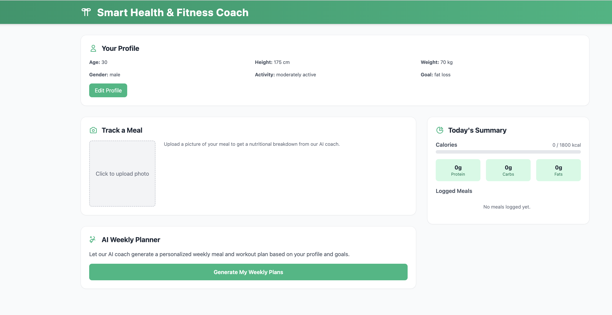
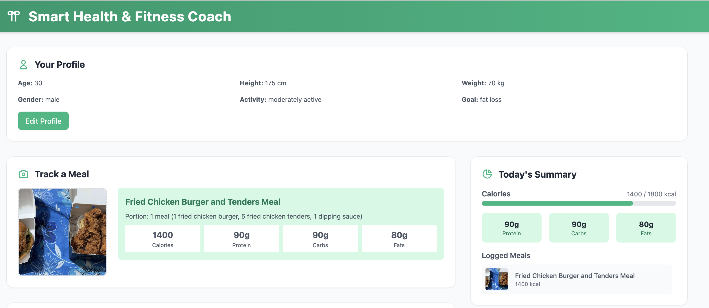
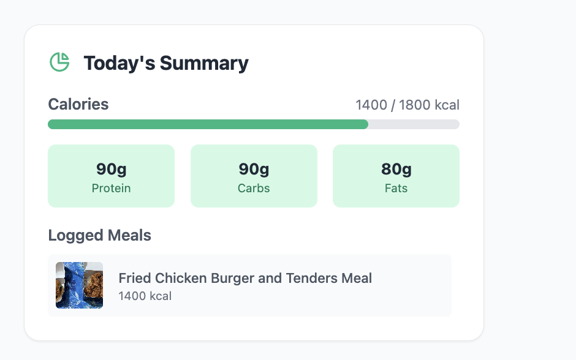
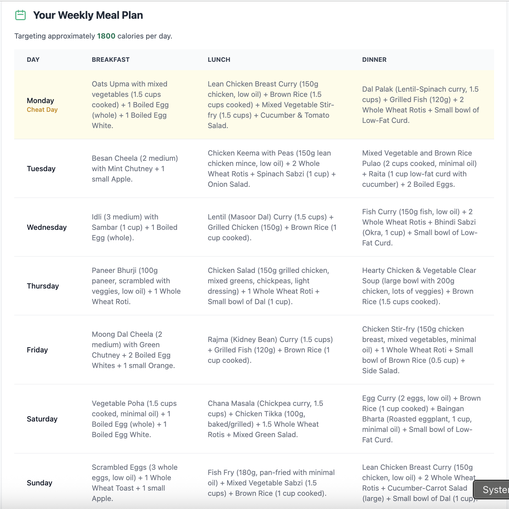
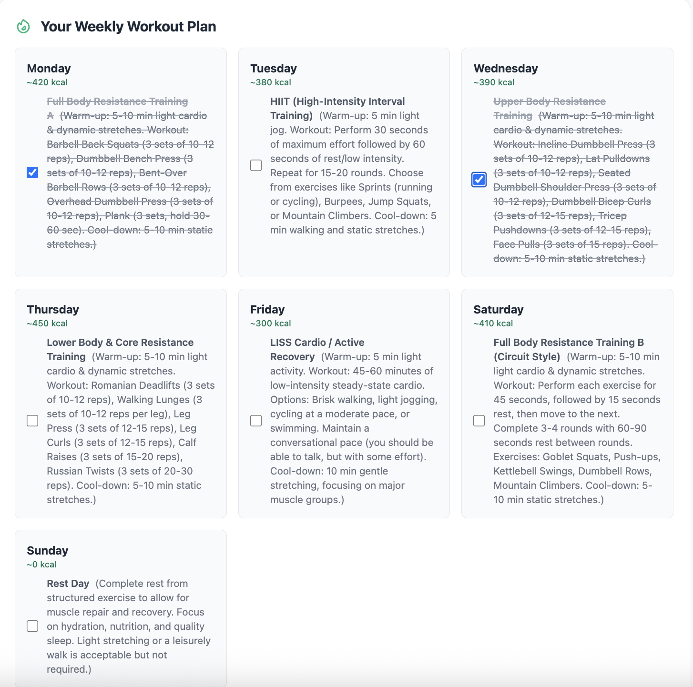
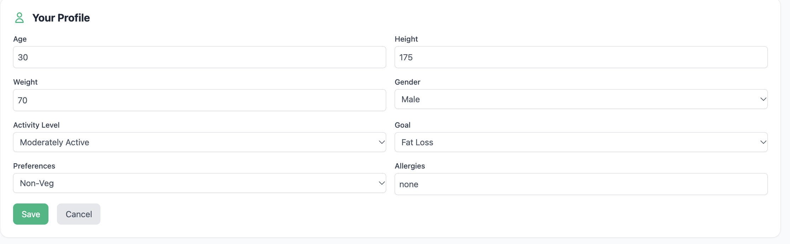

# Smart Health & Fitness Coach

A web app I made that uses Google's Gemini AI to help with the annoying parts of eating right. You upload a photo of your meal and it tells you roughly how many calories, protein, carbs and fats are in it. You can also fill in your details (age, weight, goal etc.) and it plans out a full week of meals and workouts for you.

I mainly built this to learn how to use an AI API inside a proper frontend. Getting Gemini to reply was honestly the easy part. Handling everything that goes wrong around it took a lot longer.



## Features

- Upload a food photo and get an estimate of calories, macros and portion size
- A daily summary that adds up everything you've logged against your calorie target
- One button to generate a 7 day meal plan and a 7 day workout plan
- Checkboxes on the workouts so you can tick them off
- An editable profile, which gets used in every AI request
- If Gemini fails or the quota runs out, the app falls back to default values instead of crashing

There's no backend or database. Everything runs in the browser.

## How it looks

### Meal tracking

Click the upload box, pick a photo and press **Analyze Meal**. The photo gets sent to Gemini (`gemini-2.5-flash`) along with your profile, and it sends back the numbers. The meal then gets added to your log for the day.



Keep in mind these are estimates. It can't see how much oil or ghee went into the food, so don't take them too seriously.

### Daily summary

This is on the right side. It shows calories eaten vs your target, your protein, carbs and fats for the day, and the list of meals you've added.



### Weekly meal plan

Press **Generate My Weekly Plans** and give it a few seconds. The meal plan and the workout plan are requested at the same time, so it doesn't take twice as long.



### Weekly workout plan

One card for each day. It's a mix of cardio and strength exercises, with a rough number for calories burned. You can tick off exercises as you finish them. Small feature, but I ended up liking it more than I expected.



### Profile

Age, height, weight, gender, activity level, goal (fat loss, maintenance or muscle gain), veg or non-veg, and allergies. Change these before generating plans. The defaults are just placeholders.



## Tech stack

- React 18 + TypeScript
- Vite
- Tailwind CSS
- Google Gemini API (using the `@google/genai` package)

## Getting started

### Requirements

- Node.js 18 or above (I'm using v24)
- npm
- A Gemini API key. You can get one for free from [Google AI Studio](https://aistudio.google.com/apikey)

If you're used to Python, you don't need a virtual environment here. `npm install` puts everything into a `node_modules` folder inside the project.

### Installation

```bash
git clone https://github.com/Karan1223k/SmartFitnessApp.git
cd SmartFitnessApp
npm install
```

### Adding your API key

Make a file called `.env` in the main project folder and add this line:

```
VITE_GEMINI_API_KEY=your_key_here
```

Please don't push this file. It's already in `.gitignore`.

### Running it

```bash
npm run dev
```

Then open http://localhost:3000 in your browser.

If you change the `.env` file while the app is running, stop it with Ctrl+C and start it again. Otherwise it won't pick up the new key.

To make a production build:

```bash
npm run build
npm run preview
```

## Project structure

```
smartfitnessapp/
├── App.tsx                  main layout and app state
├── index.tsx                entry point
├── index.html
├── types.ts                 TypeScript types
├── services/
│   └── geminiService.ts     all the Gemini calls and fallbacks
└── components/
    ├── Header.tsx
    ├── UserProfile.tsx
    ├── MealTracker.tsx
    ├── DailySummary.tsx
    ├── AIPlanner.tsx
    ├── MealPlanner.tsx
    ├── WorkoutPlanner.tsx
    └── common/              Card and Spinner
```

Most of the logic is in `services/geminiService.ts`. The prompts are in there too, so if you want to change what the AI gets asked, start there.

## Known limitations

- There's no message on screen when the fallback is used. If you see exactly 400 kcal, Gemini failed. Check the browser console (F12) to see why
- The fallback plans only cover one day, not the whole week
- The calorie target is a fixed number per goal (1800, 2200 or 2500). It isn't calculated from your height, weight etc.
- The meal plan prompt always asks for an Indian plan of around 1800 kcal, even if your goal is muscle gain
- Nothing is saved. If you refresh, it's all gone

## If something isn't working

If every meal comes back as "Estimated Meal, 400 kcal", the Gemini request is failing. Usually it's one of these:

- the key in `.env` is missing or wrong
- you didn't restart the app after changing `.env`
- you've used up the free quota for the day

## Future improvements

- Show a message when the fallback is being used
- Work out the calorie target properly from your body stats and use it in the meal plan
- Use Gemini's structured output instead of cleaning up the JSON by hand
- Move the API calls to a backend
- Save meals and plans, maybe with a login
- Check the calorie estimates against a real nutrition database

## Author

Karan Sood
B.Tech, Computer Science and Engineering

## License

This project is for academic and educational use.
